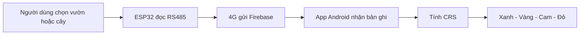

# CDGuard Demo

CDGuard là bản mẫu hệ thống hỗ trợ theo dõi điều kiện đất liên quan đến nguy cơ Cadmium khả dụng ở vườn sầu riêng.

> CRS là chỉ số sàng lọc nguy cơ, không phải kết quả định lượng Cadmium. Xác nhận Cadmium cần xét nghiệm mẫu đất tại phòng thí nghiệm.

## Trải nghiệm dành cho ban giám khảo

| Nội dung | Liên kết |
|---|---|
| APK Android | [Tải CDGuard Demo](https://drive.google.com/file/d/1wmWhSy8cj5ArVZduCOTicHxjhaT9pYJe/view?usp=drivesdk) |
| Dữ liệu mẫu trực quan | [Mở bảng dữ liệu mẫu](https://drive.google.com/file/d/1YrlQC1vrvxDe5pwyGGc8nr3bWXYJKxtg/view?usp=drivesdk) |
| Toàn bộ mã nguồn ZIP | [Tải mã nguồn](https://drive.google.com/file/d/1z7CyqLO9dI7OQLFUgdm7HdjE5VPl5bQN/view?usp=drivesdk) |
| Firebase dữ liệu thô | [Xem JSON](https://cdguard-7700a-default-rtdb.asia-southeast1.firebasedatabase.app/data.json) |

**Cách demo:** Mở ứng dụng → chọn **MỞ BẢN DEMO** → chọn **TẠO BẢN ĐO DEMO MỚI**. Mỗi lần bấm tạo một bản ghi mới trên Firebase và được đánh dấu rõ là dữ liệu mô phỏng.

## Luồng sản phẩm

## Hiện có

- Theo dõi pH, EC, độ ẩm và nhiệt độ.
- Tính CRS 0–100% theo quy tắc khoa học.
- APK Demo không cần tài khoản, không chứa API key và chỉ yêu cầu quyền Internet.
- Mỗi bản ghi gồm device_id, timestamp, pH, EC, độ ẩm, nhiệt độ.

## Hướng phát triển tiếp theo

| Giai đoạn | Phát triển | Giá trị |
|---|---|---|
| Thu thập chuẩn | Gắn từng lần đo với vườn, cây, điểm đo | Theo dõi diễn biến từng cây |
| Dữ liệu đối chiếu | Ghi điều kiện canh tác và kết quả phòng thí nghiệm | Tạo dữ liệu tin cậy |
| XGBoost + SHAP | Dự báo và giải thích các yếu tố nguy cơ | Kết quả có thể kiểm chứng |
| Gemini qua máy chủ | Chatbot dựa trên tài liệu đã kiểm duyệt | Không lộ API key |
| Mở rộng thực địa | Ảnh cây, nhật ký xử lý, nhắc lịch đo | Hỗ trợ chu trình canh tác |

XGBoost + SHAP chỉ dùng sau khi có dữ liệu đối chiếu. Gemini chỉ hỗ trợ diễn giải, không thay thế xét nghiệm hay tư vấn chuyên môn.
